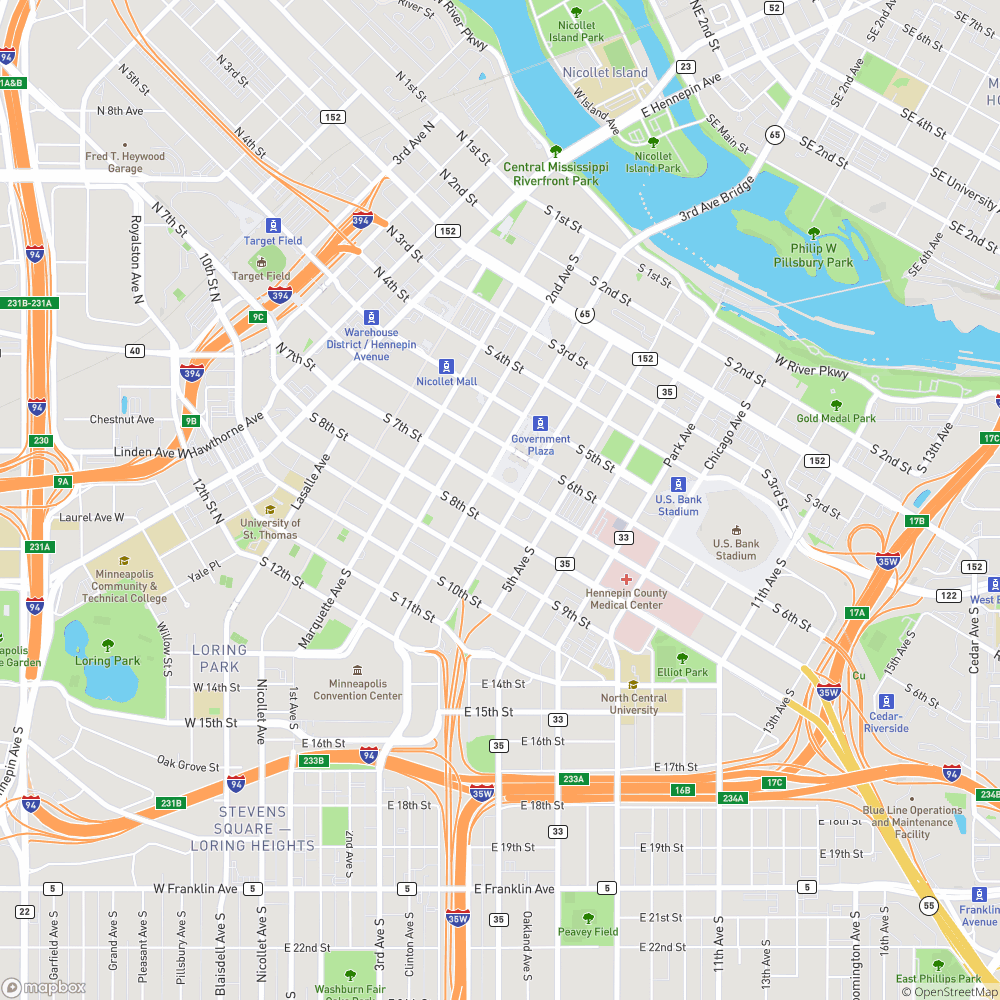
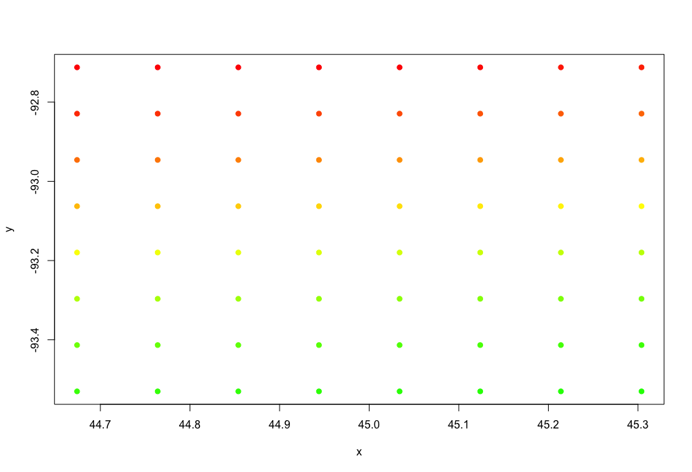
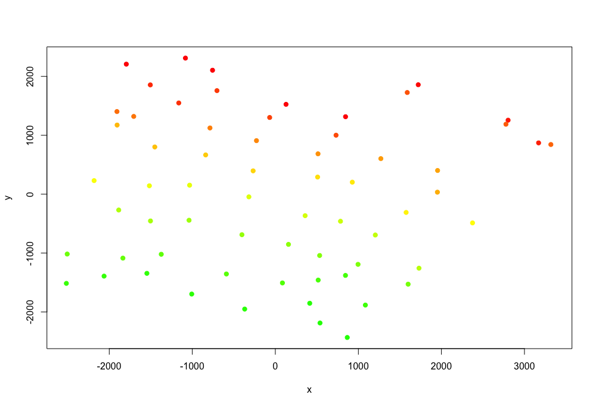
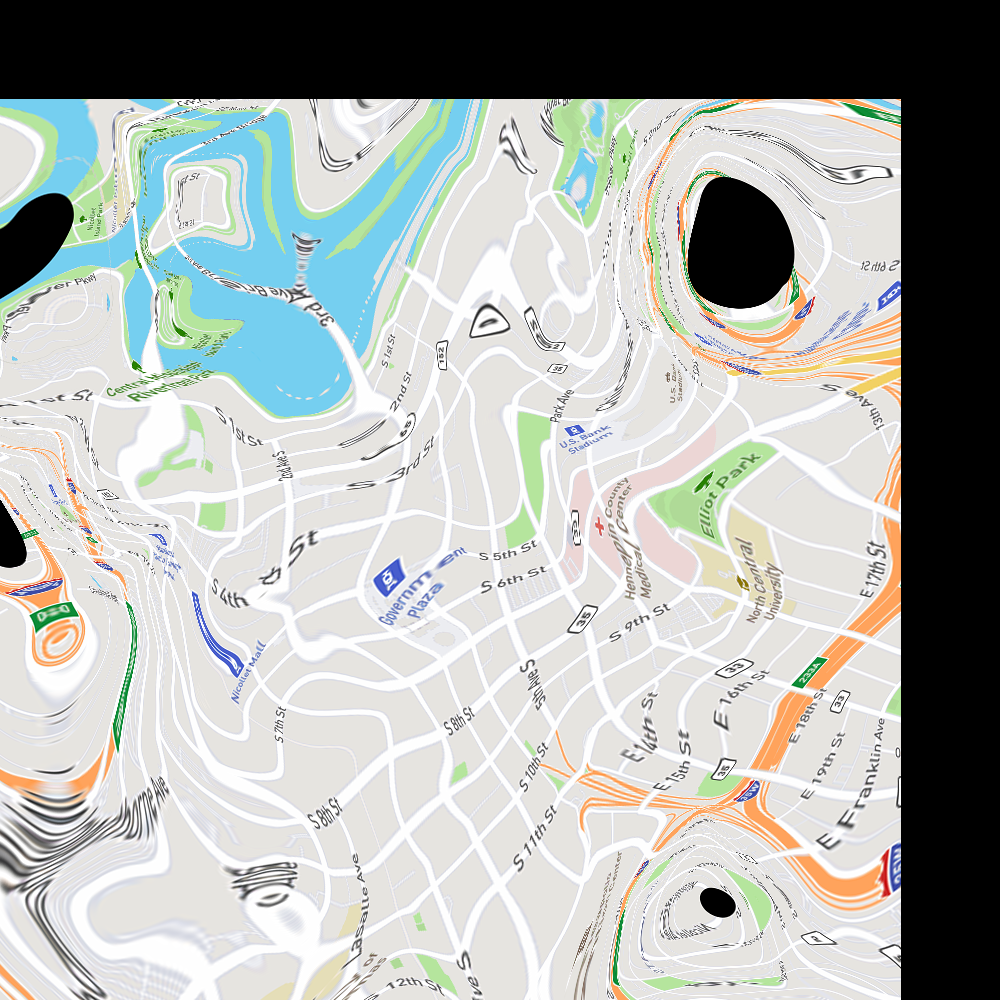

# traveltime-maps

## The idea: Create maps that visualize travel time rather than geographic distance

Almost every map today is drawn based on geographic distance. However, given the multitude of transporation options (Walk, Bike, Uber, Bird, Bus, Train) available in urban environments today, we often mentally visualize destinations based on the amount of time it will take to get there. This project is an attempt to visualize these mental maps that our brains create.

Here is the approach:
1. Start with a normal (geographic-distance-based) map of Minneapolis (using get_map.py):

2. Create 64 coordinates on this map, arranged in a grid (generate_coordinates.py does this)

3. Find the amount of time that it takes to get from each coordinate to every other coordinate, using OSRM
- 642 = 4096 routes. Unfortunately this exceeds the Google Maps API free requirements, so I found the travel time locally using OSRM (based on openstreetmap networks).

4. We now have a 64x64 matrix of travel times between coordinates. This can't really be visualized in a great way, so we have to do some dimensionality reduction. I used [Multidimensional Scaling](https://en.wikipedia.org/wiki/Multidimensional_scaling#Classical_multidimensional_scaling), also known as _Principle Coordinates Analysis_, to place each coordinate in 2-dimensional space while preserving the distances between each as well as possible. This results in the following distribution of points, where locations that can be reached more quickly are closer to each other (colors preserved from the image in step 1):

5. These travel time-distorted coordinates aren't very useful on their own, so we need to apply the same distortion to our original map. This can be thought of as a [Rubber Sheeting Transformation](http://www.corrmap.com/features/rubber-sheeting_transformation.php). However, because my original map is a png with no coordinate system information, I used an approach from computer vision, not geography. Specifically, I used the *remap()* function from the [OpenCV](https://docs.opencv.org/2.4/modules/imgproc/doc/geometric_transformations.html?highlight=remap) Library to manipulate the image based on the new coordinates, and interpolate pixels that didn't exist in the original.

6. This results in the following image:

As you can see, there are big black gaps in the map around the middle of highways (specifically the I94/I35W interchange). This is likely because travel time between two points on the highway in a car is close to zero, which distorts the map.

There is obviously tons of room for improvement. Here are some ideas:
1. It looks like something may be off with the coordinates, because the coordinate grid appears to be rotated clockwise while the final map appears to be rotated counter-clockwise
2. It might be better to use vector-based maps to begin with and then produce a raster map at the very end
3. Quality would be improved with more reference points, but complexity increases exponentially
4. OSRM only considers car and bike routes. Given the multitude of transporation options available today, it would be important to consider other options like walking, dockless scooters, public transit, etc.

This project uses a number of open-source libraries and technologies, including [openstreetmap](https://www.openstreetmap.org/), [Open Source Routing Machine (OSRM)](http://project-osrm.org/), [numpy](http://www.numpy.org/), and [OpenCV](https://opencv.org/). Map tiles are generated using [Mapbox](https://www.mapbox.com/).
